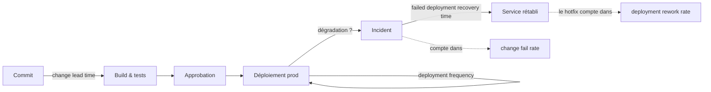

# DORA 

Pas cette Dora là :


DORA a d'abord été l'acronyme de DevOps Research and Assessment. Le programme, né en 2014, a été racheté par Google Cloud en 2018. En 2025, l'équipe a officiellement "désacronymisé" le nom : DORA est désormais un nom propre, et le rapport annuel s'appelle State of AI-assisted Software Development (et non plus Accelerate State of DevOps Report).

**Site officiel:** [https://dora.dev](https://dora.dev)

## ⚠️ Attention

> Beaucoup de ressources en ligne sur DORA parlent encore de 4 métriques et du MTTR (Mean Time To Recovery). Depuis 2021, DORA a mis à jour ses métriques et recommande désormais 5 métriques clés pour mesurer la performance des équipes DevOps.

## 🎯 Objectifs pédagogiques

À la fin de ce cours, vous saurez :

1. Énoncer les cinq métriques DORA et les définir sans ambiguïté opérationnelle.
2. Expliquer pourquoi la recherche DORA sépare **débit** et **instabilité**, et pourquoi "vitesse vs qualité" est un faux dilemme.
3. Instrumenter une chaîne de livraison pour produire ces métriques à partir des données déjà présentes dans votre VCS (Git), votre CI/CD (GitHub/GitLab) et votre outil d'incidents.
4. Interpréter les résultats sans tomber dans les pièges classiques (loi de Goodhart, comparaisons inter-équipes, évaluation individuelle).
5. Choisir les *capabilities* à travailler en priorité selon votre profil de contrainte.

## ❔ Pourquoi ce cours sur DORA ?

En tant que futur·e DevOps, on vous demandera très régulièremet de faire du reporting, souvent comptable, concernant la performance des équipes. La question sousjascente est : "est-ce qu'on livre bien ?" ; sous entendu "est-ce que l'argent dépensé pour l'équipe de développement vaut le coup et rapportera bien ?". Cette question se tranche presque toujours à l'opinion, alors qu'il existe depuis dix ans une réponse mesurable : DORA.

En produisant des métriques fiables, objectives et claires à partir des données déjà présentes dans un dépôt GIT, un outil de CI/CD et un outil de suivi d'incidents, en proposant un vocabulaire commun aux développeurs, aux ops et à la direction adossé à un travail de recherche rigoureux et vivant, DORA permet de rationaliser les choses en plus de donner des clés pour redresser la barre si on va dans le mur.

DORA est tout autant un outil d'audit et de diagnostic opérationnel collectif qu'un indicateur vivant qui ne dit pas quoi faire mais où regarder, d'autant plus et de plus en plus pertinent à l'heure où l'IA accélère l'écriture du code sans accélérer la revue ou les tests.

Savoir mesurer où sont et vers où se déplacent les goulots d'étranglement n'est plus un luxe ; DORA devient une nécessité.

**Au regard du titre**, DORA referme la boucle du DevOps (la mesure), tout en attirant l'attention sur les pratiques tant managériales qu'organisationnelles, de développement autant que pratiques, sans surcharger sur la technique ni produire un Nième tableau de bord. Cela correspond au bloc "DevOps" tout en nourissant le corpus managérial et organisationel de l'apprenant·e.

## 0. TL;DR

DORA mesure la performance de livraison logicielle avec cinq métriques issues de dix ans de recherche, réparties en deux facteurs : le débit et l'instabilité. Elles se produisent à partir de données que vous possédez déjà - dépôt Git, CI/CD, outil de suivi d'incidents - et ne veulent rien dire isolément : elles se lisent ensemble, par application, sur une fenêtre glissante. Ces métriques constituent un outil de diagnostic collectif, pas une notation : elles ne disent pas quoi faire, elles disent où regarder.

- **Les cinq métriques.** Débit : change lead time, deployment frequency, failed deployment recovery time. Instabilité : change fail rate, deployment rework rate. *(2)*
- **Le compromis vitesse/qualité est un mythe.** Démonté dès 2015 et confirmé depuis : les équipes performantes sont bonnes sur les deux axes simultanément. *(1.1)*
- **"Quatre métriques et le MTTR" est périmé.** Le MTTR est devenu en 2023 le *failed deployment recovery time*, restreint aux pannes causées par un déploiement ; la cinquième métrique et les deux facteurs datent de 2024. *(1.3, 1.4)*
- **La fiabilité n'est pas la cinquième métrique.** C'est de la performance *opérationnelle*, distincte de la performance de livraison, malgré ce qu'affichent beaucoup de tableaux de bord commerciaux. *(1.3, 3)*
- **Jamais d'évaluation individuelle, jamais de classement entre équipes.** C'est l'interdit central : les métriques se gament instantanément dès qu'elles portent un enjeu de carrière, et vous détruisez la remontée honnête des incidents. *(7.2)*
- **Médiane et P90, jamais la moyenne.** Fenêtre glissante de 28 ou 90 jours, une vue par application ou service, horodatages en UTC. *(7.3)*
- **Un change fail rate à 0 % est une alerte, pas un trophée.** Le cluster *elite* tourne autour de 5 % : à 0, soit vous déployez trop peu, soit vous ne détectez pas vos incidents. *(7.3)*
- **Les niveaux elite/high/medium/low bougent chaque année.** Ce sont des clusters recalculés sur l'échantillon de l'enquête : la seule comparaison solide est celle de votre équipe avec elle-même dans le temps. *(4.1)*
- **Le levier le plus rentable est la taille des lots.** C'est la seule pratique qui améliore les cinq métriques à la fois. *(6.1, 6.3)*
- **Les comités d'approbation externes (CAB) coûtent du débit sans acheter de stabilité.** La revue par les pairs fait mieux, y compris en environnement régulé. *(6.2, 7.1)*
- **Mesurer n'est pas améliorer.** La boucle est : mesurer, se concerter, choisir *une* contrainte, agir, re-mesurer. *(6.3)*
- **L'IA est un amplificateur, pas un levier.** Elle accélère l'écriture du code, pas la revue, les tests ni la restauration : mesurez les cinq métriques avant et après l'adoption. *(8)*

## 1. Origines et évolutions

DORA est à l'origine un programme de recherche sur les pratiques DevOps, créé par Nicole Forsgren, Jez Humble et Gene Kim. Le programme a été lancé en 2014 avec pour objectif d'identifier les pratiques qui permettent aux équipes de développement logiciel d'être plus performantes.

Connaître les origines de DORA est important pour comprendre le contexte dans lequel les métriques ont été développées et pourquoi elles sont pertinentes pour les équipes DevOps.

### 1.1 - 2014-2015 : définir "la performance IT"

La première étude cherchait à établir un lien statistique entre performance IT et performance organisationnelle. Encore fallait-il définir "performance IT" quantitativement. 

| Variable candidate (1re étude) | Ce qu'elle mesure | Retenue dans la définition 2014 ? |
| --- | --- | --- |
| **Deployment frequency** | La cadence des mises en production | ✅ |
| **Lead time for changes** | Le délai entre le commit et la production | ✅ |
| **Mean time to restore** (MTTR) | Le délai de rétablissement du service après une panne | ✅ |
| **Change fail rate** | La part des changements qui dégradent la production | ❌ |

Résultat surprenant dès la première année : **le taux d'échec ne corrèle pas suffisamment** avec les trois autres pour former un construit latent unique. La définition 2014 de la performance IT ne retient donc que trois métriques.

En 2015, le modèle se stabilise autour d'une dualité qui structure encore tout l'édifice :

- **débit** (*throughput*) : fréquence de déploiement, lead time ;
- **stabilité** : MTTR, taux d'échec des changements.

C'est aussi l'année où la recherche démonte le mythe selon lequel la vitesse se paierait en stabilité. **Les meilleures équipes sont bonnes sur les deux axes simultanément.**

> **à retenir** : le fait que la vitesse se paierait en stabilité est un mythe.

> **corrolaire à retenir** : les équipes performantes sont bonnes sur les deux axes simultanément.

### 1.2 - 2016-2018 : standardisation puis élargissement

Les quatre métriques deviennent **le référentiel de l'industrie**. En 2018, DORA constate que la livraison n'est qu'une partie du cycle de vie et introduit la **disponibilité** comme mesure de la santé opérationnelle. Le vocabulaire évolue : on ne parle plus de "performance IT" mais de **SDO performance** (*Software Delivery and Operational performance*).

> **à retenir** : la livraison n'est qu'une partie du cycle de vie. La disponibilité est une mesure de la santé opérationnelle.

### 1.3 - 2021-2023 : affiner les définitions

**2021** - La disponibilité devient la **fiabilité** (*reliability*), notion plus large englobant latence, performance et scalabilité. Le rapport 2021 la présente à tort comme "la cinquième métrique" ; DORA reconnaît depuis que la fiabilité mesure la performance *opérationnelle*, pas la performance de *livraison*. C'est une distinction à garder en tête : beaucoup de dashboards commerciaux l'affichent encore comme cinquième clé, ce qui est incorrect au sens du modèle actuel.

**2023** - Changement important : le *mean time to recover* / *time to restore service* est renommé et redéfini en **failed deployment recovery time**.

**Le raisonnement :** l'ancienne définition ne distinguait pas une panne provoquée par un changement logiciel d'une panne causée par un facteur externe (coupure de datacenter, incident fournisseur). La nouvelle définition se restreint strictement à la restauration du service après **qu'un changement mis en production a dégradé le service**. Cette restriction rend la métrique statistiquement cohérente avec les autres métriques de livraison.

> **à retenir** : le **MTTR** a cédé la place au **failed deployment recovery time**, qui ne mesure plus la restauration du service après une panne quelconque, mais la **restauration du service après un changement dégradant**. C'est une distinction importante qui n'était pas faite avant, et qui a des conséquences sur la manière dont on interprète les résultats.

### 1.4 - 2024 : de quatre clés à cinq métriques

Les chercheurs identifient que le taux d'échec des changements fonctionne comme un **proxy de la quantité de retravail** imposée à l'équipe. Pour tester cette hypothèse, ils introduisent une cinquième métrique : le **deployment rework rate**.

Le modèle est alors restructuré en deux facteurs - et notez bien que le temps de restauration bascule du côté du **débit**, ce qui surprend souvent :

| Facteur | Métriques |
| --- | --- |
| **Débit de livraison** (*software delivery throughput*) | change lead time · deployment frequency · failed deployment recovery time |
| **Instabilité de livraison** (*software delivery instability*) | change fail rate · deployment rework rate |

Plus de la moitié des équipes étudiées en 2024 présentent un **écart entre leur score de débit et leur score d'instabilité** : optimiser la vitesse seule produit un résultat incomplet.

### 1.5 - 2025-2026 : recentrage sur l'IA

Le rapport 2025 (*State of AI-assisted Software Development*, ~5k répondants) élargit le périmètre au-delà du DevOps. Les cinq métriques restent le centre de gravité de la recherche, mais l'analyse porte sur l'effet de l'adoption de l'IA.

### 1.6 - Récapitulatif des évolutions

- 2014 :  4 variables testées → 3 retenues (change fail rate ne "charge" pas)
- 2015 : Dualité débit / stabilité → le mythe vitesse vs qualité tombe
- 2018 : + disponibilité ; "IT performance" → "SDO performance"
- 2021 : disponibilité → fiabilité (à tort appelée "5e métrique")
- 2023 : MTTR → failed deployment recovery time (périmètre restreint)
- 2024 : + deployment rework rate → 5 métriques, 2 facteurs
- 2025 : DORA cesse d'être un acronyme ; rapport recentré sur l'IA

---

## 2 - Les cinq métriques

### 2.1 - Vue d'ensemble

| # | Métrique                        | Facteur     | Question à laquelle elle répond                                 |
|---|---------------------------------|-------------|-----------------------------------------------------------------|
| 1 | Change lead time                | Débit       | Combien de temps entre "c'est écrit" et "c'est en prod" ?       |
| 2 | Deployment frequency            | Débit       | À quelle cadence livre-t-on de la valeur ?                      |
| 3 | Failed deployment recovery time | Débit       | Quand une livraison casse, en combien de temps se relève-t-on ? |
| 4 | Change fail rate                | Instabilité | Quelle proportion de livraisons dégrade la prod ?               |
| 5 | Deployment rework rate          | Instabilité | Quelle part de nos livraisons ne sert qu'à réparer ?            |

Ces métriques sont à la fois :

- des **indicateurs avancés** de la performance organisationnelle et du bien-être des équipes ;
- des **indicateurs retardés** de vos pratiques de développement et de livraison.

> Autrement dit : **elles ne vous disent pas quoi faire, elles vous disent où regarder.**

### 2.2 - Change lead time

**Définition DORA.** Le temps qu'un changement met pour passer de "committé en gestion de version" à "déployé en production".

**Formule.**

```text
pour chaque changement c déployé dans la fenêtre

    lead_time(c) = deployed_at(c) − committed_at(c)
                   │                │
                   │                └─ entrée en gestion de version
                   └─ mise en production

puis, sur l'ensemble des changements

    change_lead_time     = médiane( lead_time(c) )    ← la métrique DORA
    change_lead_time_p90 = P90(     lead_time(c) )    ← à publier en complément
```

**Attention :**

- Le point de départ est le **commit**, pas la création du ticket. Mesurer depuis le ticket produit une métrique de *cycle produit* - utile, mais ce n'est pas la métrique DORA. Cette question du point de départ est l'une des plus débattues dans la communauté DORA ; l'essentiel est de **figer votre convention et de ne plus en changer**.
- Utilisez la **médiane***, pas la moyenne. La distribution des lead times est fortement asymétrique à droite : si un seul commit est oublié sur une branche pendant six mois ça fera exploser la moyenne.
- Publiez aussi le **P75 ou le P90***. La médiane dit "comment ça se passe d'habitude", le P90 dit "à quel point ça peut mal se passer". Les deux comptent.
- Un changement embarqué dans un déploiement groupé hérite du délai de tout le lot. C'est voulu : c'est exactement le coût des gros lots. Exemple : si vous avez un lot de 10 changements, dont 9 ont été committés il y a 1 jour et 1 a été committé il y a 10 jours, le lead time du lot est de 10 jours. C'est la bonne mesure du coût de ce lot : un commit qui attend 10 jours pour être livré est un commit qui a coûté 10 jours de délai à l'équipe.

> ***calcul d'une médiane** : organiser les valeurs dans l'ordre croissant et prendre celle du milieu. Exemple : pour les valeurs [1, 2, 3, 4, 5], la médiane est 3. Pour [1, 2, 3, 4], la médiane est (2+3)/2 = 2.5.

> ***P75 / P90** : Notation statistique P = percentile. Le P75 est la valeur en dessous de laquelle se trouvent 75% des observations. Le P90 est la valeur en dessous de laquelle se trouvent 90% des observations. Exemple : si vos lead times sont [1, 2, 3, 4, 5], le P75 est 4 et le P90 est 5.

#### **Ce qui l'améliore le plus, dans l'ordre :**

1. réduction de la taille des lots,
2. automatisation du déploiement,
3. allègement des processus d'approbation,
4. tests automatisés fiables.

> **À retenir :** le lead time est la métrique DORA la plus sensible à la taille des lots.

### 2.3 - Deployment frequency

**Définition DORA.** Le nombre de déploiements sur une période donnée, ou le temps écoulé entre deux déploiements.

**Formule.**

```
deployment_frequency = nombre_de_déploiements_réussis / durée_de_la_fenêtre
```

**Attention :**

- Comptez les **déploiements en production**, pas les builds ni les livraisons en préproduction.
- Pour des équipes qui déploient rarement, la fréquence brute est trompeuse. Préférez le **délai médian entre deux déploiements**, plus lisible et moins sensible aux fenêtres arbitraires.
- Attention aux fenêtres trop courtes : sur 7 jours, un jour férié fausse tout. Une fenêtre glissante de 28 ou 90 jours est plus robuste.
- Déployé ≠ publié. Si vous utilisez des feature flags, un déploiement compte même si la fonctionnalité reste désactivée. C'est un **avantage** du découplage déploiement/release, pas un artefact à corriger.

> **À retenir :** la fréquence de déploiement est la métrique DORA la plus sensible à la taille des lots.

### 2.4 - Failed deployment recovery time

**Définition DORA.** Le temps nécessaire pour se remettre d'un déploiement qui échoue et exige une intervention immédiate.

**Formule.**

```text
pour chaque incident i causé par un déploiement de la fenêtre

    recovery_time(i) = resolved_at(i) − started_at(i)
                       │                │
                       │                └─ début de la dégradation (détectée)
                       └─ service rétabli

puis, sur les seuls incidents résolus

    failed_deployment_recovery_time = médiane( recovery_time(i) )
```

**Attention :**

- **Seuls comptent les incidents causés par un déploiement.** Une panne cloud régionale ne relève pas de cette métrique.
- Le chronomètre démarre au **début de la dégradation** (détectée), pas à l'ouverture du ticket. L'écart entre les deux est en soi une mesure de la qualité de votre observabilité.
- Les incidents encore ouverts n'entrent pas dans la médiane, mais ils comptent bien dans le change fail rate. Ne les faites pas disparaître.
- Un rollback automatique en 90 secondes est un excellent score - et c'est la voie la plus rapide pour améliorer cette métrique, bien avant l'amélioration du débogage.

> **À retenir :** le failed deployment recovery time est la métrique DORA la plus sensible à la qualité de votre observabilité et de vos pratiques de débogage.


### 2.5 - Change fail rate

**Définition DORA.** La proportion de déploiements exigeant une intervention immédiate - typiquement un rollback ou un correctif d'urgence.

**Formule.**

```text
change_fail_rate = déploiements_ayant_causé_au_moins_un_incident / total_déploiements
```

**Attention :**

- Le dénominateur est le nombre de **déploiements**, pas le nombre de commits ni de tickets.
- Un déploiement ayant provoqué trois incidents compte **une fois**. La métrique mesure des déploiements défaillants, pas des incidents.
- Un échec du pipeline avant la mise en production **n'est pas** un change failure : c'est le système qui fonctionne. Ne comptez que ce qui a atteint la production.
- Historiquement, cette métrique "charge" moins bien que les autres dans l'analyse statistique. Elle est bruitée par nature. Ne construisez pas un objectif d'équipe sur elle seule.

> **À retenir :** le change fail rate est la métrique DORA la plus sensible à la qualité de vos tests et de votre observabilité.

### 2.6 - Deployment rework rate

**Définition DORA.** La proportion de déploiements **non planifiés**, survenus en réaction à un incident en production.

**Formule.**

```text
deployment_rework_rate = déploiements_non_planifiés / total_déploiements
```

**Attention :**

- Ne confondez pas avec le change fail rate. Le change fail rate compte les déploiements **qui cassent** ; le rework rate compte les déploiements **qui réparent**. Ce sont deux populations distinctes, souvent voisines en volume mais jamais identiques.
- Cette métrique est celle qui exige le plus de discipline de saisie : il faut un moyen fiable de marquer un déploiement comme "non planifié" (label `hotfix` sur la PR, branche `hotfix/*`, champ dédié dans le pipeline). Décidez de la convention **avant** de collecter.
- Un rework rate élevé avec un change fail rate faible est un signal intéressant : vous réparez beaucoup de choses qui ne viennent pas de vos propres déploiements. Cherchez du côté des dépendances, des données ou de l'infrastructure.

> **À retenir :** le deployment rework rate est la métrique DORA la plus sensible à la discipline de saisie et à la qualité de vos dépendances.

### 2.7 - Le chemin commit → prod



### 2.8 - À retenir

- le lead time est la métrique DORA la plus sensible à la taille des lots.
- la fréquence de déploiement est la métrique DORA la plus sensible à la taille des lots.
- le failed deployment recovery time est la métrique DORA la plus sensible à la qualité de votre observabilité et de vos pratiques de débogage.
- le change fail rate est la métrique DORA la plus sensible à la qualité de vos tests et de votre observabilité.
- le deployment rework rate est la métrique DORA la plus sensible à la discipline de saisie et à la qualité de vos dépendances.

---

## 3 - Ce que DORA ne mesure pas

Une bonne partie des mésusages vient de gens qui demandent aux métriques DORA de répondre à des questions qu'elles n'adressent pas.

| Question                                             | DORA y répond ? | Où chercher                             |
|------------------------------------------------------|-----------------|-----------------------------------------|
| Livre-t-on vite et sûrement ?                        | ✅               | Les cinq métriques                      |
| Le service tient-il ses promesses aux utilisateurs ? | ❌               | Fiabilité, SLO/SLI, error budgets       |
| Livre-t-on la bonne chose ?                          | ❌               | Métriques produit, *user-centric focus* |
| Cet ingénieur est-il performant ?                    | ❌ **jamais**    | Rien. Voir plus loin                     |
| L'équipe est-elle en bonne santé ?                   | Partiellement   | SPACE, DevEx, enquêtes de bien-être     |
| Où sont les goulots d'étranglement ?                 | Indirectement   | Value Stream Mapping                    |

**Fiabilité.** Depuis 2021, DORA la traite comme une mesure de performance **opérationnelle**, distincte de la performance de livraison. Une équipe peut déployer à la demande avec 4 % de change fail rate tout en exploitant un service qui s'effondre sous charge : excellente livraison, mauvaise fiabilité. C'est un complément indispensable au tableau de bord, mais ce n'est pas une sixième métrique de livraison.

**Autres cadres complémentaires.** SPACE (satisfaction, performance, activité, communication, efficience) pour la productivité au sens large, DevEx pour l'expérience développeur, VSM (*value stream management*) pour la vue bout-en-bout. DORA elle-même recommande de choisir le cadre qui "parle" à votre organisation plutôt que d'en empiler trois.

---

## 4 - Repères de performance

### 4.1 - Les niveaux de performance DORA

Dora a longtemps classé les équipes en quatre niveaux de performance : *elite*, *high*, *medium* et *low*. Ces niveaux sont issus d'une **analyse en clusters** menée chaque année sur l'échantillon de l'enquête. Les frontières bougent d'une année sur l'autre en fonction des répondants. Ce sont des repères directionnels, pas une grille de notation ! Ce ne sont **pas des seuils fixes**.

La preuve par les chiffres : entre 2023 et 2024, le cluster *high* est passé de 31 % à 22 % des répondants, tandis que le cluster *low* montait de 17 % à 25 %. Ce n'est pas un durcissement des critères - le cluster *low* affichait de moins bonnes fréquences de déploiement et de moins bons lead times qu'en 2023. La performance de l'industrie n'est pas un objectif statique, c'est un **mouvement perpétuel**.

### 4.2 - Distribution 2024

| Cluster | Part des répondants |
|---------|---------------------|
| Elite   | 19 %                |
| High    | 22 %                |
| Medium  | 35 %                |
| Low     | 25 %                |

Ordres de grandeur pour le cluster *elite* : déploiement **à la demande**, lead time **inférieur à la journée**, change fail rate **autour de 5 %**, restauration après échec **en moins d'une heure**.

Comparé au cluster *low*, le cluster *elite* affiche : lead time **127×** plus court, **182×** plus de déploiements, change fail rate **8×** plus bas, et restauration **2 293×** plus rapide.

> **À retenir :** les écarts entre clusters sont **colossaux**. Les métriques DORA ne sont pas des indicateurs de performance marginale, elles mesurent des différences de performance **de plusieurs ordres de grandeur**.

### 4.3 - L'anomalie de 2024, et pourquoi elle vous concerne

Pour la première fois, le cluster *medium* a affiché un change fail rate **plus bas** (~10 %) que le cluster *high* (~20 %). Les métriques, qui évoluent d'habitude de concert, ont divergé.

DORA a dû trancher : classer plus haut les équipes qui déploient souvent avec plus d'échecs, ou celles qui déploient lentement avec moins d'échecs. Le choix s'est porté sur les premières - les deux clusters récupérant de toute façon en moins d'une journée.

> **À retenir :** ne lisez jamais une métrique DORA isolément. Un change fail rate de 20 % n'est ni bon ni mauvais dans l'absolu ; il dépend entièrement de votre fréquence de déploiement et de votre temps de restauration.

### 4.4 - Les sept profils d'équipe de 2025

Le rapport 2025 abandonne le classement unidimensionnel au profit de **sept profils** issus d'une analyse en clusters intégrant performance, stabilité **et bien-être**. C'est un outil de diagnostic bien plus actionnable que le classement elite/low.

| Profil                    | Part  | Signature                                                  |
|---------------------------|-------|------------------------------------------------------------|
| Harmonious high-achievers | 20 %  | Excellents partout, environnement stable, faible friction  |
| Pragmatic performers      | 20 %  | Vitesse et stabilité solides, engagement moyen             |
| Constrained by process    | 17 %  | Systèmes stables mais processus inefficaces, burnout élevé |
| Stable and methodical     | 15 %  | Qualité élevée, rythme délibérément lent                   |
| Legacy bottleneck         | 11 %  | Mode réactif permanent, systèmes instables, moral dégradé  |
| High impact, low cadence  | 7 %   | Fort impact, faible débit, forte instabilité               |
| Foundational challenges   | ~10 % | Mode survie, lacunes structurelles                         |

**Deux enseignements majeurs :**

1. Les deux premiers profils représentent près de **40 % de l'échantillon**. Des équipes réellement excellentes à la fois en débit et en stabilité existent en nombre : le compromis vitesse/qualité est bien un mythe, pas un idéal théorique.
2. Le diagnostic détermine l'intervention. Une équipe *constrained by process* doit réduire la friction de son processus ; une équipe *high impact, low cadence* doit d'abord automatiser pour gagner en stabilité. Le même investissement produit des résultats opposés selon le profil.

> **À retenir :** les métriques DORA ne sont pas des objectifs en soi. Elles sont un outil de diagnostic pour déterminer **où agir** et **dans quel ordre**.

---

## 5 - Instrumenter la chaîne

### 5.1 - Les trois seules sources dont vous avez besoin

Tout le calcul repose sur trois flux d'évènements :

| Flux             | Origine typique                      | Sert à                              |
|------------------|--------------------------------------|-------------------------------------|
| **Commits**      | Git (VCS)                            | lead time                           |
| **Déploiements** | CI/CD, registre de déploiement       | fréquence, lead time, dénominateurs |
| **Incidents**    | PagerDuty, Opsgenie, Jira, issues... | fail rate, recovery time, rework    |

> **À retenir :** le maillon faible n'est presque jamais le commit ni le déploiement : c'est **le lien entre un incident et le déploiement qui l'a causé**. Sans ce lien, deux métriques sur cinq sont impossibles à calculer correctement.

### 5.2 - Le contrat de définitions

Avant d'écrire la moindre ligne de code, écrivez ce document et faites-le valider par toute l'équipe. Il tient sur une page.

```yaml
# dora-definitions.yml - contrat d'équipe, versionné avec le code
application: example-api

deploiement:
  compte_comme_deploiement: "Deployment Status 'success' sur env=production"
  exclut: ["preproduction", "rollback automatique", "redémarrage d'infra"]
  horodatage: "fin du déploiement (created_at du status success)"

changement:
  point_de_depart: "committer date du commit sur la branche par défaut"
  # alternative possible : ouverture de la PR. À figer, jamais à changer en cours de route.

incident:
  definition: "dégradation en production nécessitant une intervention immédiate"
  source: "issue GitHub avec le label 'incident'"
  debut: "horodatage de la détection (alerte), pas de l'ouverture du ticket"
  fin: "service rétabli, pas 'post-mortem rédigé'"
  rattachement_deploiement: "champ 'caused_by' renseigné à la clôture"

rework:
  marqueur: "PR portant le label 'hotfix' ou branche hotfix/*"

fenetre_de_reference: "90 jours glissants"
agregation: "médiane pour les durées, P90 publié en complément"
```

Ce fichier vaut plus cher que n'importe quel dashboard. Deux équipes qui n'ont pas le même contrat produisent des chiffres non comparables - et c'est précisément la raison pour laquelle DORA déconseille d'agréger les métriques de plusieurs équipes.

### 5.3 - Exemple : Émettre les évènements depuis GitHub Actions

Exemple minimal, avec les majeures en vigueur au 3 septembre 2026 : `actions/checkout@v6` et `actions/github-script@v9`, toutes deux sur Node 24. 

> ⚠️ Node 20 doit être retiré des runners le 16 septembre 2026 : si vos workflows utilisent encore `checkout@v4/v5` ou `github-script@v7`, c'est le moment de les monter.

Voici les étapes pour émettre les évènements de déploiement et de statut de déploiement depuis un workflow GitHub Actions. L'exemple ci-dessous montre comment créer un évènement de déploiement, exécuter un script de déploiement, puis marquer le déploiement comme réussi.

```yaml
name: deploy-production

on:
  push:
    branches: [main]

permissions:
  contents: read
  deployments: write

jobs:
  deploy:
    runs-on: ubuntu-latest
    environment: production
    steps:
      - uses: actions/checkout@v6

      - name: Créer l'évènement de déploiement
        id: deployment
        uses: actions/github-script@v9
        with:
          script: |
            const deployment = await github.rest.repos.createDeployment({
              owner: context.repo.owner,
              repo: context.repo.repo,
              ref: context.sha,
              environment: 'production',
              required_contexts: [],
              auto_merge: false,
            });
            return deployment.data.id;

      - name: Déployer
        run: ./scripts/deploy.sh

      - name: Marquer le déploiement comme réussi
        if: success()
        uses: actions/github-script@v9
        with:
          script: |
            await github.rest.repos.createDeploymentStatus({
              owner: context.repo.owner,
              repo: context.repo.repo,
              deployment_id: ${{ steps.deployment.outputs.result }},
              state: 'success',
              environment: 'production',
            });
```

L'API Deployments de GitHub est le bon endroit où stocker ces évènements : elle est native, gratuite, requêtable, et survit à un changement d'outillage d'observabilité.

> **Bonne pratique de sécurité :** en production, épinglez les actions sur un SHA de commit plutôt que sur un tag mouvant (`uses: actions/checkout@<sha>`). GitHub recommande explicitement cette pratique - un tag peut être redéplacé sans préavis.

### 5.4 - Le même pipeline sous GitLab CI

La logique est inversée par rapport à GitHub Actions : il n'y a **aucun appel d'API à écrire**. Le mot-clé `environment` suffit - GitLab crée l'enregistrement de déploiement, l'horodate et le rattache au commit tout seul.

```yaml
# .gitlab-ci.yml
stages: [build, test, deploy]

.deploy_base:
  stage: deploy
  script:
    - ./scripts/deploy.sh
  environment:
    name: production
    url: https://paiements.example.com
    deployment_tier: production   # explicite : ne laissez pas GitLab deviner

deploy_production:
  extends: .deploy_base
  rules:
    - if: $CI_COMMIT_BRANCH == $CI_DEFAULT_BRANCH

deploy_hotfix:                    # même déploiement, ref distinctive
  extends: .deploy_base
  rules:
    - if: $CI_COMMIT_BRANCH =~ /^hotfix\//
```

Attention :

- **Déclarez `deployment_tier` explicitement.** Sans lui, GitLab *devine* le palier à partir du nom de l'environnement (`prod`, `production`, `live` → palier production). Un environnement nommé `prd` ou `live-eu` sort du périmètre sans prévenir, et votre fréquence de déploiement s'effondre pour une raison purement orthographique.
- **Le marqueur de rework passe par la `ref`.** Un déploiement GitLab ne porte pas de label. Le job `deploy_hotfix` ne fait rien de différent : il existe uniquement pour que la branche `hotfix/*` soit lisible dans l'enregistrement, ce qui suffit à alimenter le `is_rework` du module 6.

**Relire les évènements.** L'API Deployments accepte le filtrage temporel côté serveur :

```rest
GET /projects/:id/deployments
      ?environment=production
      &status=success
      &finished_after=2026-06-05T00:00:00Z
      &order_by=finished_at&sort=asc
```

Le mapping vers le modèle de données du chapitre 6 est direct - et sans la requête par déploiement qui épuise le quota GitHub (chapitre 6.6) :

| Champ GitLab                 | Champ `Deployment` |
|------------------------------|--------------------|
| `id`                         | `id`               |
| `finished_at`                | `deployed_at`      |
| `sha`                        | `commit_shas`      |
| `ref` commence par `hotfix/` | `is_rework`        |

### 5.4 - Requête SQL de référence

Exemple de requête SQL pour calculer les cinq métriques DORA sur une fenêtre glissante de 90 jours. Les tables sont supposées contenir les colonnes suivantes :

```sql
WITH fenetre AS (
    SELECT
        NOW() - INTERVAL '90 days' AS debut,
        NOW()                      AS fin
),
deploiements AS (
    SELECT d.id, d.deployed_at, d.is_rework
    FROM deployments d, fenetre f
    WHERE d.environment = 'production'
      AND d.status = 'success'
      AND d.deployed_at >= f.debut
      AND d.deployed_at <  f.fin
),
lead_times AS (
    SELECT EXTRACT(EPOCH FROM d.deployed_at - c.committed_at) AS secondes
    FROM deploiements d
    JOIN deployment_commits dc ON dc.deployment_id = d.id
    JOIN commits c            ON c.sha = dc.commit_sha
    WHERE d.deployed_at >= c.committed_at
),
echecs AS (
    SELECT DISTINCT i.caused_by_deployment_id AS deployment_id
    FROM incidents i
    JOIN deploiements d ON d.id = i.caused_by_deployment_id
),
recoveries AS (
    SELECT EXTRACT(EPOCH FROM i.resolved_at - i.started_at) AS secondes
    FROM incidents i
    JOIN deploiements d ON d.id = i.caused_by_deployment_id
    WHERE i.resolved_at IS NOT NULL
)
SELECT
    (SELECT COUNT(*) FROM deploiements) / 90.0
        AS deployment_frequency_per_day,
    (SELECT PERCENTILE_CONT(0.5) WITHIN GROUP (ORDER BY secondes) / 3600
       FROM lead_times)
        AS change_lead_time_hours_p50,
    (SELECT PERCENTILE_CONT(0.9) WITHIN GROUP (ORDER BY secondes) / 3600
       FROM lead_times)
        AS change_lead_time_hours_p90,
    (SELECT PERCENTILE_CONT(0.5) WITHIN GROUP (ORDER BY secondes) / 3600
       FROM recoveries)
        AS failed_deployment_recovery_hours_p50,
    (SELECT COUNT(*) FROM echecs)::float
        / NULLIF((SELECT COUNT(*) FROM deploiements), 0)
        AS change_fail_rate,
    (SELECT COUNT(*) FROM deploiements WHERE is_rework)::float
        / NULLIF((SELECT COUNT(*) FROM deploiements), 0)
        AS deployment_rework_rate;
```

Notez le `NULLIF` sur les dénominateurs : une fenêtre sans déploiement doit produire `NULL`, pas une division par zéro ni un `0 %` trompeur.

### 5.5 - Outils prêts à l'emploi

DORA recommande officiellement quatre outils dont le code source est disponible :

| Outil                                                                                 | Nature                                                                                    | Quand le choisir                                                                                                                                              |
|---------------------------------------------------------------------------------------|-------------------------------------------------------------------------------------------|---------------------------------------------------------------------------------------------------------------------------------------------------------------|
| **[Apache DevLake](https://devlake.apache.org/)** (en incubation)                     | Plateforme de données dev complète, dashboards [Grafana](https://grafana.com/)            | Sources multiples ([Jira](https://www.atlassian.com/software/jira) + [GitHub](https://github.com/) + [Jenkins](https://www.jenkins.io/)), besoin d'historique |
| **[Middleware](https://github.com/middlewarehq/middleware)**                          | Outil open source dédié aux métriques DORA                                                | Démarrage rapide, périmètre [GitHub](https://github.com/)/[GitLab](https://about.gitlab.com/)                                                                 |
| **[Liatrio backstage-dora-plugin](https://github.com/liatrio/backstage-dora-plugin)** | Plugin [Backstage](https://backstage.io/)                                                 | Vous avez déjà un portail développeur Backstage                                                                                                               |
| **[OpenDORA](https://github.com/DevoteamNL/opendora)** (Devoteam)                     | Plugin [Backstage](https://backstage.io/) adossé à [DevLake](https://devlake.apache.org/) | Backstage + DevLake déjà en place                                                                                                                             |

> ⛔ **Ne partez pas sur Four Keys.** Le projet `dora-team/fourkeys`, longtemps cité comme la référence Google, est **archivé depuis janvier 2024** et en lecture seule. Beaucoup de tutoriels encore en ligne le recommandent ; ils sont périmés.

**Comment séquencer ?** DORA met en garde contre le fait de "se concentrer sur la mesure au détriment de l'amélioration". Construire des intégrations vers cinq systèmes pour obtenir des chiffres au dixième près n'est pas un bon premier investissement. Commencez par le [DORA Quick Check](https://dora.dev/quickcheck/) - une auto-évaluation de quelques minutes - puis par une conversation d'équipe. L'outillage vient après, quand vous savez quoi mesurer et pourquoi.

---

## 6 - Améliorer : le catalogue de capabilities

Les **métriques** sont un **thermomètre**. Le catalogue de __*capabilities*__ de DORA est la **pharmacie**.

Il recense les pratiques dont la recherche a établi statistiquement qu'elles prédisent une meilleure performance.

### 6.1 - Capabilities techniques

| Capability                                 | Effet principal                                        |
|--------------------------------------------|--------------------------------------------------------|
| Gestion de version                         | Prérequis de tout le reste ; filet de sécurité         |
| Intégration continue                       | Lead time ↓, fail rate ↓                               |
| Livraison continue                         | Fréquence ↑, recovery ↓                                |
| Automatisation du déploiement              | Fréquence ↑, recovery ↓                                |
| Tests automatisés                          | Fail rate ↓, lead time ↓                               |
| Gestion des données de test                | Débloque les tests automatisés                         |
| Travail par petits lots                    | **Le levier le plus rentable, sur les cinq métriques** |
| Développement sur tronc commun             | Lead time ↓                                            |
| Gestion des changements de base de données | Fail rate ↓                                            |
| Sécurité omniprésente                      | Fail rate ↓ sans coût sur la vitesse                   |
| Infrastructure flexible                    | Fréquence ↑                                            |
| Architecture faiblement couplée            | Autonomie des équipes, fréquence ↑                     |
| Maintenabilité du code                     | Lead time ↓                                            |
| Observabilité et supervision               | Recovery ↓                                             |
| Notification proactive des pannes          | Recovery ↓                                             |

### 6.2 - Capabilities de processus et de culture

Allègement des approbations de changement, limites de travail en cours, gestion visuelle, visibilité du flux de valeur, expérimentation d'équipe, retours utilisateurs, qualité de la documentation, culture organisationnelle générative (modèle de Westrum), culture d'apprentissage, leadership transformationnel, satisfaction au travail, bien-être, équipes libres de choisir leurs outils.

**Deux résultats contre-intuitifs de la recherche, à connaître :**

1. **Les comités d'approbation externes (CAB - *Change Advisory Board*) n'améliorent pas la stabilité** - ils dégradent le débit sans contrepartie. La **revue par les pairs** sur chaque changement produit de **meilleurs résultats**, y compris en environnement régulé.
2. **La culture organisationnelle prédit la performance de livraison.** Ce n'est pas un vœu pieux managérial : c'est un résultat statistique robuste et répété depuis dix ans.

### 6.3 - La boucle d'amélioration recommandée par DORA

1. **Établir une ligne de base** avec le [Quick Check](https://dora.dev/quickcheck/).
2. **Discuter des points de friction** en équipe, idéalement avec une cartographie du flux de valeur.
3. **S'engager collectivement** sur **une seule** contrainte - la plus significative.
4. **Traduire en plan**, avec des indicateurs avancés propres (durée des revues de code, taux de flakiness des tests…).
5. **Faire le travail.** Il n'y a pas de raccourci : il faut changer la façon de travailler.
6. **Vérifier les progrès** (Quick Check, rétrospectives, mesures).
7. **Recommencer.**

Si vous ne deviez retenir qu'un levier : **réduisez la taille des lots**. Des changements plus petits sont plus faciles à raisonner, à faire circuler dans le pipeline, et à annuler en cas d'échec. C'est la seule pratique qui améliore simultanément le débit et la stabilité.

> **Pro tip :** l'agilité, grâce à ses rituels, quel que soit le framework choisi, est un excellent moyen de mettre en œuvre cette boucle d'amélioration. Les rétrospectives sont un moment privilégié pour discuter des points de friction et décider collectivement d'une contrainte à améliorer.

> **Le mot de *Captain Obvious* :** Agir sans vérifier les progrès est un gaspillage. Vérifier les progrès sans agir est une illusion. La boucle d'amélioration DORA est un cycle vertueux : **mesurer → se concerter → planifier → agir → mesurer** *rince & repeat*.

---

## 7 - Pièges et anti-patterns

### 7.1 - Les sept pièges recensés par DORA

| Piège                                   | Ce que ça donne en pratique                                                                                         |
|-----------------------------------------|---------------------------------------------------------------------------------------------------------------------|
| **Transformer la métrique en objectif** | Loi de Goodhart. "Toute application déploie 1×/jour d'ici décembre" → déploiements vides pour gonfler le compteur |
| **La métrique unique**                  | Un seul chiffre pour un système complexe. Il faut plusieurs métriques en tension                                    |
| **Le secteur comme bouclier**           | "Nous sommes en environnement régulé, on ne peut rien changer." La recherche dit le contraire                     |
| **Comparer l'incomparable**             | Une app mobile face à un mainframe. Les métriques valent **par application ou service**                             |
| **Propriété en silo**                   | Le lead time à la dev, le fail rate aux ops → chacun optimise sa métrique contre l'autre                            |
| **La compétition**                      | Le classement entre équipes tue la remontée honnête des incidents                                                   |
| **Mesurer au lieu d'améliorer**         | Six mois de projet dashboard, zéro changement de pratique                                                           |

#### 7.1.1 - Loi de Goodhart

Goodhart* : "Quand une mesure devient un objectif, elle cesse d'être une bonne mesure." C'est le piège le plus fréquent et le plus dangereux. Il se manifeste par des comportements de contournement, des métriques artificiellement gonflées, et une perte de confiance dans les chiffres.

*Goodhart, C. A. E. (1975). Problems of Monetary Management: The U.K. Experience. In: *Monetary Theory and Practice*. London: Macmillan.

### 7.2 - L'interdit absolu : l'évaluation individuelle

**N'utilisez jamais les métriques DORA dans une évaluation de performance individuelle.** Ce n'est pas une question de sensibilité, c'est une question de validité :

- Elles mesurent un **système de livraison**, **pas une personne**. Un développeur ne contrôle ni le processus d'approbation, ni la fiabilité de la suite de tests, ni l'architecture.
- Elles se gament instantanément dès qu'elles portent un enjeu de carrière : découpage artificiel des commits, déploiements vides, requalification des incidents en "maintenance planifiée".
- Vous détruisez précisément ce que vous cherchiez à mesurer : la remontée honnête des incidents.

C'est un débat récurrent au sein de la communauté DORA, et la réponse est constante : **jamais, jamais, jamais**. Les métriques DORA sont un outil de diagnostic collectif, pas un instrument de pression individuelle.

> **Le piège RH :** L'utilisation des métriques DORA dans les évaluations individuelles peut entraîner des comportements de contournement et une perte de confiance dans les données. Les fonctions RH ou managériales peuvent être tentées de vous demander de leur fournir, puisque vous avez des métriques, des chiffres, des tableaux de bord pour leur permettre de récupérer des indicateurs individuels en vue des entretiens annuels : ne cédez pas à la pression et évangélisez. Si vous cédez, les équipes auront tôt fait d'agir pour gonfler leurs mesures personnelles détruisant tout l'intérêt de DORA.

### 7.3 - Erreurs d'implémentation fréquentes

| Erreur                                      | Symptôme                                          | Correction                                             |
|---------------------------------------------|---------------------------------------------------|--------------------------------------------------------|
| Moyenne au lieu de médiane                  | Lead time absurde après une branche oubliée       | Médiane + P90                                          |
| Compter les builds comme des déploiements   | Fréquence 10× trop élevée                         | Filtrer sur `environment=production`                   |
| *Recovery time* toutes causes (ex-"MTTR") | Délai de restauration pollué par les pannes cloud | Ne retenir que les incidents causés par un déploiement |
| Agréger toutes les équipes                  | Un chiffre unique qui ne décrit personne          | Une vue par application                                |
| Fenêtre de 7 jours                          | Bruit ingérable, réunions stériles                | 28 ou 90 jours glissants                               |
| Datetimes naïfs                             | Décalage silencieux d'une à deux heures           | UTC partout, aware obligatoire                         |
| Fail rate à 0 % affiché fièrement           | Vous ne détectez peut-être pas vos incidents                | Vérifier l'observabilité avant de célébrer             |

Le dernier mérite un développement. **Un change fail rate de 0 % sur trois mois n'est presque jamais une bonne nouvelle.** Soit vous déployez trop rarement pour que la métrique ait un sens, soit vous ne détectez pas vos dégradations, soit vos incidents ne sont pas rattachés aux déploiements. Les équipes du cluster *elite* tournent autour de 5 %, pas de 0.

> **Mentra :** Si c'est parfait, c'est suspect → vérifier, c'est la clé.

> **Mentra bis:** Si c'est catastrophique, faut vérifier la métrique → il est rare qu'une équipe travaille aussi mal, d'autant plus si elle est stable et délivre → bien check ce tableau et revoir le processus de collecte.

---

## 8 - DORA et l'IA (rapport 2025)

### 8.1 - La thèse : l'IA est un amplificateur

Le rapport 2025 (*State of AI-assisted Software Development*, ~5 000 répondants, plus de 100 heures d'entretiens) tient en une phrase : **l'IA ne crée pas d'organisations performantes, elle révèle celles qui le sont déjà.**

Le résultat central, formulé par DORA : **l'IA améliore le débit, mais souvent au prix de la stabilité si les fondations ne sont pas solides.** Pour une équipe disposant d'une plateforme robuste, de tests fiables et de petits lots, l'IA accélère un flux déjà sain. Pour une équipe croulant sous la dette technique, elle accélère la production de changements qui viennent saturer une chaîne de livraison déjà engorgée.

L'IA accélère l'**écriture** du code. Elle n'accélère pas la revue, ni les tests, ni le déploiement, ni la restauration après incident. Le goulot d'étranglement se déplace en aval et devient plus visible.

### 8.2 - Adoption massive, confiance limitée

L'adoption est quasi universelle : environ **90 % des développeurs** utilisent l'IA dans leur travail quotidien. La confiance, elle, reste très en retrait - et les réserves ne portent pas seulement sur l'exactitude du code produit, mais aussi sur la perte de compétences, le déplacement d'emplois et les usages malveillants.

Un point est souvent cité : l'efficacité de **l'IA réduit** mécaniquement **les occasions d'apprentissage** par la pratique pour les profils juniors. Cela demande des dispositifs d'apprentissage délibérés, pas seulement des licences.

### 8.3 - Les sept capabilities qui amplifient les bénéfices de l'IA

Le *DORA AI Capabilities Model* (décembre 2025) identifie sept capacités :

1. **Position claire et communiquée sur l'IA** - l'ambiguïté crée du risque ; une politique explicite fournit la sécurité psychologique nécessaire à l'expérimentation.
2. **Écosystèmes de données sains** - les bénéfices de l'IA sont amplifiés par des données internes de qualité, accessibles et unifiées.
3. **Données internes accessibles à l'IA** - brancher l'IA sur votre documentation et votre code la fait passer d'assistant générique à expert spécialisé.
4. **Plateformes internes de qualité** - des chemins de livraison automatisés et sécurisés ("voies pavées") : sans eux, le temps gagné avec l'IA se perd dans le goulot suivant.
5. **Gestion de version rigoureuse** - filet de sécurité critique quand l'IA accélère le rythme des changements.
6. **Travail par petits lots** - contrepoids direct au risque d'instabilité induit par l'accélération.
7. **Orientation utilisateur** - sans elle, l'adoption de l'IA peut avoir un effet **négatif** sur la performance : on va plus vite dans la mauvaise direction.

### 8.4 - Le paradoxe de la plateforme

Résultat inattendu du rapport : les plateformes internes de qualité corrèlent avec une **légère hausse** de l'instabilité de livraison. DORA l'interprète comme de la **compensation du risque** : une organisation capable de se relever vite peut se permettre d'expérimenter davantage et d'accepter plus de petits échecs.

C'est une lecture mature du risque et une raison de plus de ne jamais lire le change fail rate isolément.


### 8.5 - Implication pratique

Si vous déployez de l'IA dans vos équipes, **mesurez les cinq métriques avant et après**. Ne regardez pas seulement le débit : si votre change fail rate et votre rework rate montent en même temps que votre fréquence de déploiement, vous n'avez pas gagné en performance, vous avez déplacé le coût.

### 8.6 À retenir : sur l'usage de l'IA

1. L'IA accélère l'écriture du code, pas la revue, pas les tests, pas la restauration.
2. Elle ne corrige aucun des goulots, elle les rend impossible à ignorer.
3. Vérifier les métriques avant et après l'adoption si possible
4. L'IA n'est pas un levier de performance, c'est un révélateur.
5. L'IA amplifie un flux fonctionnel et déjà sain : elle révèle les organisations qui sont déjà performantes
6. L'IA amplifie l'engorgement sur de la dette technique : elle précipite les organisation non performantes
7. Si la fréquence de deloy monte en même temps que le change fail rate et rework rate : pas de gain de performance mais déplacement du coût en aval

---

## Annexe A - Glossaire

| Terme                               | Définition                                                                                                      |
|-------------------------------------|-----------------------------------------------------------------------------------------------------------------|
| **Change lead time**                | Délai entre le commit en gestion de version et le déploiement en production                                     |
| **Deployment frequency**            | Nombre de déploiements sur une période, ou délai entre deux déploiements                                        |
| **Failed deployment recovery time** | Temps de restauration après un déploiement ayant dégradé la production (ex-MTTR, redéfini en 2023)              |
| **Change fail rate**                | Part des déploiements exigeant une intervention immédiate                                                       |
| **Deployment rework rate**          | Part des déploiements non planifiés consécutifs à un incident (introduit en 2024)                               |
| **Throughput / Instability**        | Les deux facteurs du modèle depuis 2024                                                                         |
| **Reliability**                     | Performance opérationnelle (disponibilité, latence, scalabilité). Distincte de la performance de livraison      |
| **Capability**                      | Pratique dont la recherche établit qu'elle prédit une meilleure performance                                     |
| **Cluster analysis**                | Méthode statistique produisant les niveaux elite/high/medium/low. Frontières recalculées chaque année           |
| **Construit latent**                | Variable non observable directement, inférée depuis plusieurs mesures corrélées                                 |
| **Culture générative**              | Culture à haute confiance et forte coopération (modèle de Westrum)                                              |
| **VSM**                             | *Value Stream Management*, gestion du flux de valeur bout-en-bout                                               |
| **Médiane (P50)**                   | Valeur centrale d'une série ordonnée, insensible aux valeurs extrêmes : l'agrégation par défaut des durées DORA |
| **Percentile (P75, P90)**           | Valeur sous laquelle se situent 75 % ou 90 % des observations. Le P90 dit à quel point ça peut mal se passer    |
| **Fenêtre glissante**               | Période mobile (28 ou 90 jours) recalculée à chaque mesure, pour absorber jours fériés et à-coups               |
| **Datetime aware / naïf**           | Horodatage avec ou sans fuseau. Un datetime naïf décale silencieusement les durées : UTC partout                |
| **MTTR**                            | *Mean time to restore*. Terme périmé depuis 2023, remplacé par le failed deployment recovery time               |
| **CAB**                             | *Change Advisory Board*, comité d'approbation externe à l'équipe. Dégrade le débit sans améliorer la stabilité  |
| **Loi de Goodhart**                 | "Quand une mesure devient un objectif, elle cesse d'être une bonne mesure"                                    |
| **SPACE**                           | Cadre de productivité complémentaire : satisfaction, performance, activité, communication, efficience           |
| **DevEx**                           | *Developer experience* : friction, flux et charge cognitive vécus par les développeurs                          |
| **Four Keys**                       | Ancien projet Google de référence (`dora-team/fourkeys`), archivé depuis janvier 2024                           |

---

## Annexe B - Notions et études citées

Cette annexe développe les notions, cadres et travaux de recherche que le cours mobilise sans toujours les expliciter. Chaque entrée se termine par les sections auxquelles elle se rapporte : elle se lit au moment où la question se pose, pas forcément dans l'ordre.

**Culture et organisation** : modèle de Westrum, sécurité psychologique, leadership transformationnel
**Méthode et statistiques** : construits latents et clusters, médiane et percentiles
**Notions empruntées à d'autres travaux** : loi de Goodhart, SPACE, DevEx, loi de Little, VSM, approbations externes

### Modèle de Westrum

Le modèle de Westrum est une typologie des cultures organisationnelles proposée par Ron Westrum, sociologue des organisations, dans un article de 2004 (*A typology of organisational cultures, Quality & Safety in Health Care*). Il l'a construite en étudiant la sécurité en aviation et en santé, en cherchant pourquoi certaines organisations traitent bien l'information et d'autres non.

L'idée centrale : la façon dont une organisation traite l'information est le meilleur prédicteur de sa performance et de sa sécurité. Une culture se caractérise par ce qui arrive à une mauvaise nouvelle quand elle remonte.

Les trois types, selon six dimensions :

| Dimension                       | Pathologique (pouvoir)  | Bureaucratique (règles)                   | Générative (performance) |
|---------------------------------|-------------------------|-------------------------------------------|--------------------------|
| Coopération                     | faible                  | modérée                                   | forte                    |
| Porteurs de mauvaises nouvelles | "fusillés"              | ignorés                                   | formés et écoutés        |
| Responsabilités                 | esquivées               | cloisonnées                               | partagées                |
| Collaboration inter-équipes     | découragée              | tolérée                                   | encouragée               |
| Après un échec                  | recherche d'un coupable | recherche de justice / de la règle violée | enquête sur les causes   |
| Nouveauté                       | écrasée                 | source de problèmes                       | mise en œuvre            |

**Pourquoi en parler ici ?** dans Accelerate, Forsgren, Humble et Kim ont repris cette typologie et l'ont opérationnalisée comme construit latent (mesuré par 7 items de questionnaire sur l'échelle de Westrum). La recherche montre que le score de culture générative prédit à la fois la performance de livraison logicielle et la performance organisationnelle : c'est la justification de son statut de capability DORA.

C'est aussi ce qui relie la culture aux pratiques techniques dans le modèle : le *blameless postmortem*, l'absence de CAB, l'autonomie des équipes sur leurs outils sont des manifestations concrètes d'une culture générative, pas des pratiques indépendantes.

> *Se rapporte à : 6.2, 7.1, 7.2, et à la sécurité psychologique ci-dessous.*

### Sécurité psychologique (Edmondson, 1999)

Amy Edmondson, professeure à la Harvard Business School, définit la **sécurité psychologique** comme *la croyance partagée que l'équipe est un espace sûr pour la prise de risque interpersonnelle* ("Psychological Safety and Learning Behavior in Work Teams", *Administrative Science Quarterly*, 1999).

Le résultat fondateur mérite d'être raconté, parce qu'il est contre-intuitif. En étudiant des unités de soins hospitalières, Edmondson s'attend à ce que les équipes les mieux notées déclarent **moins** d'erreurs de médication. Elle observe l'inverse : les meilleures unités en déclarent jusqu'à dix fois plus. Elles n'en commettent pas davantage, elles les **signalent**. Ailleurs, l'erreur se tait.

Google retrouve ce facteur en tête de *Project Aristotle* (2012-2016), son étude interne sur ce qui distingue les équipes efficaces : la sécurité psychologique arrive devant la fiabilité des coéquipiers, la clarté de la structure, le sens du travail et son impact.

**Pourquoi en parler ici ?** C'est le mécanisme qui explique 7.2. Une organisation qui adosse les métriques DORA à l'évaluation individuelle fait exactement ce que faisaient les unités les moins performantes d'Edmondson : elle rend le signalement coûteux. Le change fail rate à 0 % de 7.3 n'est alors pas une bonne nouvelle, c'est le symptôme : plus personne n'a intérêt à qualifier un incident d'incident. C'est la ligne "porteurs de mauvaises nouvelles" du tableau de Westrum, observée à l'échelle de l'équipe.

> *Se rapporte à : 6.2, 7.2, 7.3, et au modèle de Westrum ci-dessus.*

### Leadership transformationnel (Rafferty & Griffin, 2004)

La capability "leadership transformationnel" listée en 6.2 n'est pas un mot-valise managérial : DORA la mesure avec l'échelle de Rafferty et Griffin (*The Leadership Quarterly*, 2004), en cinq dimensions.

| Dimension                              | Ce qui est mesuré                                                  |
|----------------------------------------|--------------------------------------------------------------------|
| Vision                                 | Le leader a une idée claire de la direction, et l'équipe la connaît |
| Communication inspirante               | Il donne du sens, y compris quand c'est difficile                   |
| Stimulation intellectuelle             | Il pousse à remettre en question les hypothèses de travail          |
| Leadership de soutien                  | Il tient compte des besoins et du point de vue des personnes        |
| Reconnaissance personnelle             | Il reconnaît nommément le travail bien fait                         |

Le résultat DORA est plus subtil qu'un "bon leader = bonnes métriques" : le leadership transformationnel **ne produit pas** directement la performance, il **rend possible** l'adoption des capabilities techniques. Les équipes qui en bénéficient adoptent plus facilement l'intégration continue, l'automatisation et les petits lots, et ce sont ces pratiques-là qui déplacent les métriques.

Deux corollaires, dans les deux sens :

- un excellent leadership sans investissement dans les pratiques techniques ne produit rien de mesurable ;
- les équipes qui cumulent le meilleur leadership **et** aucune autonomie réelle figurent parmi les moins performantes de l'échantillon. L'encouragement sans le pouvoir d'agir est un piège.

> *Se rapporte à : 6.2, 6.3.*

### Comment DORA fabrique ses résultats : construits latents et clusters

Trois expressions du cours viennent directement de la méthodologie de l'enquête. Sans elles, plusieurs passages restent opaques : "le change fail rate ne *charge* pas" (1.1), "les frontières bougent d'une année sur l'autre" (4.1).

**Le matériau.** DORA est une **enquête déclarative annuelle**, pas une instrumentation de chaînes de livraison réelles. Les répondants (~5 000 en 2025) ne fournissent pas des durées mesurées : ils cochent des cases sur deux types d'échelles.

**Échelle ordinale.** Des catégories *ordonnées*, dont les écarts ne sont ni égaux ni connus. Les cinq métriques sont collectées ainsi. Pour la fréquence de déploiement, par exemple : "à la demande", "entre une fois par jour et une fois par semaine", "entre une fois par semaine et une fois par mois", "moins d'une fois tous les six mois". On sait qu'une tranche est supérieure à la suivante ; on ne sait pas *de combien*. Passer de la troisième à la deuxième tranche n'est pas "un point" de progrès : c'est un saut dont l'amplitude réelle varie d'un répondant à l'autre.

**Échelle de Likert.** Un cas particulier d'échelle ordinale : une affirmation, et un degré d'accord en cinq ou sept positions (de "pas du tout d'accord" à "tout à fait d'accord"). C'est ainsi que sont mesurés tous les construits non chiffrables du modèle — culture générative, sécurité psychologique, burnout, leadership, qualité de la documentation. Un construit n'est **jamais** mesuré par une seule question, mais par un jeu d'items dont on vérifie ensuite la cohérence.

La culture générative, par exemple, est mesurée par les sept items de l'échelle de Westrum, chacun noté en degré d'accord :

> Dans mon équipe : l'information est activement recherchée · les porteurs de mauvaises nouvelles ne sont pas punis · les responsabilités sont partagées · la collaboration transverse est encouragée et récompensée · l'échec déclenche une enquête · les idées nouvelles sont bien accueillies · les échecs sont traités avant tout comme des occasions d'améliorer le système.

C'est le tableau ci-dessus (modèle de Westrum), transformé en questionnaire. Le score de culture d'une organisation est l'agrégat de ces sept réponses, pas le jugement d'un observateur.

**Trois conséquences pratiques :**

1. **On ne fait pas de moyenne naïve sur de l'ordinal.** L'écart entre "d'accord" et "tout à fait d'accord" n'est pas celui entre "neutre" et "d'accord". D'où le recours aux médianes, aux distributions et à des méthodes d'analyse adaptées, plutôt qu'à une note sur 10.
2. **Les chiffres publiés sont des tranches déclarées, pas des mesures.** Quand le rapport annonce un lead time "inférieur à la journée" pour le cluster *elite*, c'est une case cochée par des humains. C'est le piège de comparaison détaillé plus bas.
3. **Le déclaratif porte ses biais** — perception, désirabilité sociale, méconnaissance de ses propres chiffres. DORA les compense par le volume et par la validation statistique des construits, pas par l'instrumentation. À l'inverse, **votre pipeline vous donne des durées exactes que l'enquête n'a pas** : l'avantage méthodologique n'est pas entièrement de leur côté.

Enfin, le recrutement se fait par diffusion dans la communauté (échantillon de convenance, effet boule de neige) : l'échantillon **n'est pas représentatif** de l'industrie mondiale, et il change chaque année. Tout ce que produit l'enquête est donc **relatif à son échantillon**.

**Construit latent.** Une variable qu'on ne peut pas observer directement et qu'on infère depuis plusieurs mesures corrélées. "Performance de livraison" ne se mesure pas au thermomètre : on l'infère de métriques qui varient ensemble. Une **analyse factorielle** vérifie que ces indicateurs *chargent* bien sur le même facteur, et des indices de fiabilité (alpha de Cronbach, fiabilité composite) confirment qu'ils mesurent bien une seule et même chose.

C'est précisément ce qui s'est joué en 2014 (1.1) : le change fail rate **ne chargeait pas assez** sur le même facteur que les trois autres métriques. Il n'a pas été jugé inutile, il a été jugé *statistiquement différent*. Dix ans plus tard, ce même constat aboutit à en faire la tête d'un **facteur séparé**, l'instabilité (1.4). Le modèle actuel à deux facteurs est l'aboutissement d'une anomalie de 2014.

**Prédire n'est pas causer.** DORA écrit systématiquement "prédit", jamais "cause". Le design est corrélationnel et transversal : une photographie par an, analysée par modèles d'équations structurelles. C'est une base solide, les relations étant robustes et répliquées sur dix ans et des dizaines de milliers de répondants, mais ce n'est pas une preuve expérimentale. À garder en tête quand on cite "la culture prédit la performance" (6.2) devant un public sceptique. La formulation honnête est : *les organisations qui ont l'un ont statistiquement l'autre, année après année*.

**Analyse en clusters.** Les niveaux elite/high/medium/low ne sont pas des seuils fixés par des experts : ce sont des **groupes que l'algorithme trouve dans les données de l'année**, en rassemblant les répondants qui se ressemblent sur les cinq métriques. Trois conséquences directes :

- les frontières se déplacent chaque année (4.1) : une équipe peut "rétrograder" sans avoir rien changé ;
- les clusters ne sont ni d'égale taille ni en nombre fixe, comme le montrent les sept profils de 2025 (4.4) ;
- quand les métriques cessent d'évoluer de concert, l'algorithme ne tranche pas tout seul : DORA a dû **arbitrer** en 2024 (4.3).

> **À retenir :** "nous sommes *elite*" n'a de sens que par rapport à l'échantillon d'une année donnée. La seule comparaison solide est celle de votre équipe avec elle-même dans le temps.

> *Se rapporte à : 1.1, 1.4, 4.1, 4.3, 4.4, 6.2.*

### Médiane et percentiles : pourquoi la moyenne ment

Les durées de livraison ne suivent **jamais** une loi normale. Leur distribution est fortement asymétrique à droite : une masse de changements rapides, et une longue traîne de changements très lents. Sur ce type de distribution, la moyenne est tirée par la traîne et ne décrit personne. Une branche oubliée trois mois suffit à déplacer la moyenne de plusieurs jours alors que le vécu de l'équipe n'a pas bougé d'un millimètre : c'est la première ligne du tableau 7.3.

| Mesure         | Ce qu'elle dit                                              | Ce qu'elle cache                                |
|----------------|-------------------------------------------------------------|-------------------------------------------------|
| Moyenne        | Rien d'utile sur une distribution asymétrique               | Tout, dès qu'il existe une valeur extrême       |
| Médiane (P50)  | Le cas typique : la moitié des changements font mieux       | Les cas douloureux, qui sont dans la traîne     |
| P90            | "À quel point ça peut mal se passer" un jour sur dix      | Rien : c'est ce dont les gens parlent en rétro  |

Le couple **P50 + P90** est bien plus informatif que l'un des deux pris seul. Un P50 stable avec un P90 qui s'envole est un signal net : il existe une **catégorie** de changements qui coince — migrations de base de données, changements inter-équipes, livraisons nécessitant une validation externe. C'est une piste de cartographie du flux de valeur, pas une dégradation générale.

**Piège de comparaison :** l'enquête DORA collecte des réponses **par tranches** ("moins d'un jour", "entre un jour et une semaine"…), pas des durées instrumentées. Vos chiffres et les leurs ne sont pas commensurables au chiffre près. Les **ordres de grandeur** de 4.2, eux, restent parlants.

> *Se rapporte à : 4.2, 5.4, 7.3.*

### Loi de Goodhart, et ses cousines

La formulation originale de **Charles Goodhart** (1975), économiste, portait sur la politique monétaire britannique : *"Toute régularité statistique observée tend à s'effondrer dès qu'on exerce une pression sur elle à des fins de contrôle."* La Banque d'Angleterre ciblait des agrégats monétaires qui cessaient de se comporter comme prévu dès l'instant où ils devenaient des cibles.

La version courte que tout le monde cite — *"Quand une mesure devient un objectif, elle cesse d'être une bonne mesure"* — n'est pas de Goodhart : c'est une reformulation de l'anthropologue **Marilyn Strathern** (1997), qui l'appliquait à l'évaluation des universités britanniques.

Deux énoncés voisins, utiles à connaître :

- **Loi de Campbell** (Donald T. Campbell, 1979) : plus un indicateur social quantitatif est utilisé pour la prise de décision, plus il est sujet à des pressions de corruption et plus il déforme les processus qu'il est censé observer. Campbell l'illustrait avec les tests scolaires et les statistiques criminelles, deux domaines où le mécanisme est massivement documenté.
- **Substitution** (*surrogation*, littérature en contrôle de gestion) : à force de piloter par l'indicateur, l'organisation finit par confondre l'indicateur et l'objectif, et par gérer le premier à la place du second.

**Le mécanisme est le même dans les trois cas, et il ne suppose aucune malhonnêteté.** Dès qu'une mesure porte un enjeu, l'effort se déplace vers ce qui est mesuré, et le lien entre la mesure et ce qu'elle représentait se rompt. Des gens de bonne foi produisent le résultat.

**Corollaire DORA :** c'est la raison de fond pour laquelle les cinq métriques ne se lisent qu'**ensemble et en tension** (4.3). Gonfler la fréquence de déploiement seule est trivial ; l'améliorer sans dégrader le change fail rate ni le rework rate suppose de changer réellement les pratiques. Le jeu de métriques est conçu pour que la triche sur l'une se voie sur les autres — à condition de les regarder toutes.

> *Se rapporte à : 4.3, 7.1, 7.1.1, 7.2.*

### SPACE (Forsgren et al., 2021)

*The SPACE of Developer Productivity* (Forsgren, Storey, Maddila, Zimmermann, Houck, Butler — *ACM Queue*, 2021) est une réponse directe à l'usage abusif des métriques d'activité : lignes de code, nombre de commits, points de story. Le cadre pose que la productivité est **multidimensionnelle** et ne se réduit pas à un axe.

| Dimension                              | Exemples de mesures                                                |
|----------------------------------------|--------------------------------------------------------------------|
| **S** — Satisfaction et bien-être      | Satisfaction au travail, burnout, adéquation des outils            |
| **P** — Performance                    | Résultat produit : fiabilité, impact client, les métriques DORA    |
| **A** — Activité                       | Volume de commits, de revues, de tickets : la moins fiable seule   |
| **C** — Communication et collaboration | Qualité de la documentation, délai de revue, découvrabilité        |
| **E** — Efficience et flux             | Interruptions, temps d'attente, capacité à travailler sans blocage |

Deux règles d'usage, souvent oubliées par ceux qui citent le cadre :

1. Choisir des métriques dans **au moins trois dimensions**, jamais une seule.
2. En inclure au moins une **perceptuelle**, issue d'une enquête auprès des personnes : ce que vivent les gens n'est pas dans les logs.

**Position par rapport à DORA :** les cinq métriques couvrent essentiellement **P**, et une part de **E**. Elles ne disent rien de **S** ni de **C**. C'est exactement ce que traduit la ligne "L'équipe est-elle en bonne santé ? → Partiellement" du tableau de la section 3.

> *Se rapporte à : 3.*

### DevEx (Noda et al., 2023)

*DevEx: What Actually Drives Productivity* (Noda, Storey, Forsgren, Greiler — *ACM Queue*, 2023) prolonge SPACE du côté du vécu, en trois dimensions seulement, ce qui en fait un cadre facile à mettre en œuvre.

| Dimension                  | Question posée aux développeurs                                       |
|----------------------------|------------------------------------------------------------------------|
| **Boucles de rétroaction** | Combien de temps pour savoir si ce que je viens de faire fonctionne ?  |
| **Charge cognitive**       | Combien de choses dois-je tenir en tête pour accomplir cette tâche ?   |
| **État de flux**           | Puis-je travailler sans interruption ni attente d'un tiers ?           |

**Complémentarité avec DORA :** DORA mesure ce que le système **produit**, DevEx mesure ce qu'il **coûte à ceux qui sont dedans**. Les deux se rejoignent presque toujours par le même levier, raccourcir une boucle de rétroaction. Une CI qui passe de 40 à 6 minutes améliore simultanément le change lead time et l'expérience vécue, pour une seule et même intervention.

Le profil *constrained by process* de 4.4 (17 % de l'échantillon 2025 : systèmes stables, processus inefficaces, burnout élevé) est la description exacte d'une **DevEx dégradée avec des métriques correctes**. Sans mesure du vécu, cette population reste invisible dans un tableau de bord DORA.

> *Se rapporte à : 3, 4.4, 8.2.*

### Taille des lots, loi de Little et théorie des files d'attente

La section 6.3 affirme que si l'on ne devait retenir qu'un levier, ce serait la réduction de la taille des lots. Ce n'est pas une intuition d'artisan, c'est un résultat de théorie des files d'attente.

**Loi de Little** (John Little, 1961). Dans un système stable, `L = λ × W`, soit **en-cours = débit × temps de traversée**. Réécrite pour une chaîne de livraison :

```
lead time  =  travail en cours  ÷  débit
```

À débit constant, **diviser l'en-cours par deux divise le lead time par deux**. C'est toute la justification de la capability "limites de travail en cours" listée en 6.2 : limiter le WIP n'est pas une discipline morale, c'est la seule variable directement actionnable de l'équation.

Les petits lots agissent sur les **deux** termes : ils réduisent l'en-cours et la variabilité par changement. Reinertsen (*The Principles of Product Development Flow*, 2009) explique pourquoi on laisse malgré tout les files grossir : contrairement à un stock physique en usine, une file d'attente de développement (branches non fusionnées, PR en attente, tickets "prêts à déployer") **n'apparaît nulle part au bilan**. Elle est invisible, donc elle n'est pas gérée.

**Effet en cascade sur les cinq métriques** — c'est ce qui fait des petits lots la seule capability qui les améliore toutes :

| Métrique             | Pourquoi un petit lot aide                          |
|----------------------|------------------------------------------------------|
| Change lead time     | Moins d'en-cours (Little) et revue plus rapide       |
| Deployment frequency | Mécanique : plus de lots, donc plus de déploiements  |
| Change fail rate     | Moins de surface de changement par déploiement       |
| Recovery time        | Diagnostic évident, retour arrière trivial           |
| Rework rate          | Moins de reprises, parce que moins d'effets de bord  |

L'origine est le *one-piece flow* du système de production Toyota ; le mérite de DORA est d'en avoir mesuré l'effet dans le logiciel.

> *Se rapporte à : 2.8, 6.1, 6.2, 6.3, 8.3.*

### Cartographie du flux de valeur (VSM)

Née chez Toyota sous le nom de *material and information flow mapping*, popularisée par Rother et Shook (*Learning to See*, 1998). Le principe : dessiner **toutes** les étapes entre la demande et la mise en production, et documenter pour chacune trois chiffres — le temps de travail effectif, le temps d'attente, et la part de travail accepté sans retour en arrière (*%C&A*).

L'indicateur qui frappe les équipes est l'**efficacité de flux** :

```
efficacité de flux  =  temps de travail effectif  ÷  temps total écoulé
```

Elle dépasse rarement 15 % dans une chaîne non optimisée. Autrement dit : **l'essentiel du lead time est de l'attente** — revue en attente d'un relecteur, environnement de test occupé, validation métier, fenêtre de déploiement hebdomadaire. Optimiser la vitesse de codage sur un flux à 10 % d'efficacité revient à accélérer les 10 %.

C'est la raison pour laquelle la section 3 renvoie à la cartographie pour la question "où sont les goulots ?", et pour laquelle l'étape 2 de la boucle d'amélioration (6.3) la recommande explicitement. **DORA vous dit *que* le lead time est de six jours ; la cartographie vous dit *où* les six jours sont passés.** Les deux outils ne sont pas concurrents, ils sont séquentiels.

> *Se rapporte à : 3, 6.2, 6.3.*

### Le résultat sur les approbations externes (CAB)

L'affirmation de 6.2 — les comités d'approbation n'améliorent pas la stabilité — est l'un des résultats les plus contestés du corpus DORA, et l'un des mieux établis. Elle vient des campagnes 2018-2019, reprises dans *Accelerate* (chapitre 7).

La recherche a comparé les équipes selon leur régime d'approbation des changements : approbation par un **organisme externe** (CAB), approbation **par un pair**, ou **aucune** approbation formelle. Résultat :

- l'approbation externe est corrélée **négativement** au lead time et à la fréquence de déploiement ;
- elle est **sans corrélation** avec le change fail rate.

Elle coûte donc du débit sans acheter de stabilité. Ce qui fonctionne à la place : **revue par les pairs sur chaque changement, plus contrôles automatisés dans le pipeline**, le tout tracé.

**La nuance à avoir en tête face à un comité de gouvernance :** DORA ne dit pas "supprimez tout contrôle". Elle dit *déplacez le contrôle au plus près du changement, et automatisez-le*. La séparation des tâches exigée par les référentiels de conformité est satisfaite par une revue par les pairs tracée dans l'outil de gestion de version. Un CAB hebdomadaire qui approuve trente changements en une heure sans les lire n'apporte aucune garantie réelle, seulement une signature. C'est aussi la réponse au piège "le secteur comme bouclier" de 7.1 : les équipes performantes en environnement régulé ont supprimé le CAB, pas les contrôles.

> *Se rapporte à : 6.2, 7.1.*

---

## Annexe C - Ressources

### Officielles

- [dora.dev/guides/dora-metrics](https://dora.dev/guides/dora-metrics/) - définitions de référence des cinq métriques
- [dora.dev/insights/dora-metrics-history](https://dora.dev/insights/dora-metrics-history/) - l'évolution du modèle, source du module 1
- [dora.dev/capabilities](https://dora.dev/capabilities/) - catalogue complet des capabilities
- [dora.dev/quickcheck](https://dora.dev/quickcheck/) - auto-évaluation rapide
- [conversations.dora.dev](https://conversations.dora.dev/) - questions pour animer une discussion d'équipe
- [dora.community](https://dora.community/) - communauté de pratique

### Rapports

- *State of AI-assisted Software Development* (septembre 2025)
- *DORA AI Capabilities Model* (décembre 2025)
- *Accelerate State of DevOps Report* 2024 et antérieurs - [dora.dev/research](https://dora.dev/research/)

### Livres

- Forsgren, Humble, Kim - *Accelerate: The Science of Lean Software and DevOps* (2018). La référence méthodologique.
- Farley - *Modern Software Engineering* (2021).
- Reinertsen, D. G. - *The Principles of Product Development Flow: Second Generation Lean Product Development* (2009). Files d'attente, taille des lots, coût du délai. Fonde la section "taille des lots" de l'annexe B.
- Rother, M., Shook, J. - *Learning to See: Value Stream Mapping to Create Value and Eliminate Muda* (Lean Enterprise Institute, 1998). Le manuel d'origine de la cartographie du flux de valeur.
- Edmondson, A. C. - *The Fearless Organization* (2019). La version praticienne des travaux de 1999 sur la sécurité psychologique.

### Travaux cités dans l'annexe B

Références complètes des études mobilisées par l'annexe B, dans l'ordre où elles y apparaissent.

**Culture et organisation**

- Westrum, R. (2004). "A typology of organisational cultures". *Quality & Safety in Health Care*, 13(Suppl 2), ii22-ii27.
- Edmondson, A. C. (1999). "Psychological Safety and Learning Behavior in Work Teams". *Administrative Science Quarterly*, 44(2), 350-383.
- Google, *Project Aristotle* (2012-2016). Étude interne sur l'efficacité des équipes, longtemps publiée sur le site re:Work de Google. La sécurité psychologique y arrive en tête des cinq facteurs.
- Rafferty, A. E., Griffin, M. A. (2004). "Dimensions of transformational leadership: Conceptual and empirical extensions". *The Leadership Quarterly*, 15(3), 329-354. L'échelle en cinq dimensions utilisée par DORA.

**Mesure et effets pervers**

- Goodhart, C. A. E. (1975). "Problems of Monetary Management: The U.K. Experience". Dans *Monetary Theory and Practice*. Londres : Macmillan. La formulation originale.
- Strathern, M. (1997). "Improving ratings: audit in the British University system". *European Review*, 5(3), 305-321. La reformulation courte, universellement citée à tort comme étant de Goodhart.
- Campbell, D. T. (1979). "Assessing the impact of planned social change". *Evaluation and Program Planning*, 2(1), 67-90. La loi de Campbell.

**Cadres complémentaires**

- Forsgren, N., Storey, M.-A., Maddila, C., Zimmermann, T., Houck, B., Butler, J. (2021). "The SPACE of Developer Productivity". *ACM Queue*, 19(1).
- Noda, A., Storey, M.-A., Forsgren, N., Greiler, M. (2023). "DevEx: What Actually Drives Productivity". *ACM Queue*, 21(2).

**Flux et files d'attente**

- Little, J. D. C. (1961). "A Proof for the Queuing Formula: L = λW". *Operations Research*, 9(3), 383-387.

**Outils** - voir 5.6.

---
